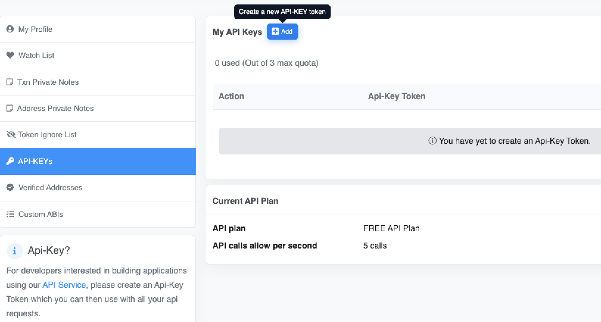
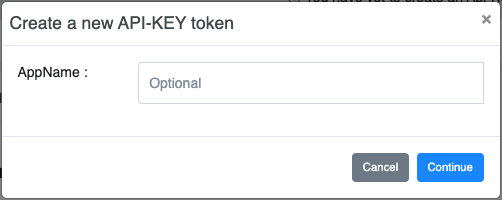

# Block Explorer and API Keys

### Block Explorers



* [https://cronoscan.com/](https://cronoscan.com)
* [https://cronos.org/explorer/](https://cronos.org/explorer/)



* [https://testnet.cronoscan.com/](https://testnet.cronoscan.com/)
* [https://cronos.org/explorer/testnet3](https://cronos.org/explorer/testnet3)



### **Creating API Keys on CronoScan**

The CronoScan Developer APIs are designed to provide accessible and consistent Cronos data to the Cronos community. The APIs are provided as a community service with a rate up to five calls per second per IP. Users need to [register](https://cronoscan.com/register) for a CronoScan account to create an API key.\
After registration, a CronoScan user account will have a quota of up to three API keys.


Cronoscan Testnet uses the same API key as Cronoscan Mainnet.


On the [CronoScan user dashboard](https://cronoscan.com/myaccount), select “**API-KEYs**” in the left column or go to [https://cronoscan.com/myapikey](https://cronoscan.com/myapikey).

Click “**Create a new API-KEY token**”. Then optionally input an \_**AppName** \_ if you wish to.

After the “**API**_**-**_**KEY Token**” is successfully created, a message will show up as per the example below. You can now use the “**API key token**” for your applications on Cronos!

&#x20;                                               

