# Unity

## Unity

### Pre-requisites

This SDK assumes that you have a basic understanding of Unity, ERC721 and EVM practices.

#### Supported OS

This documentation currently supports WebGL, IOS and Android builds. Other platforms may work but there is no guarantee. We will extend our support to other platforms after we have stabilized our current architecture.

#### Other Requirements

* **Mobile IDE**: If you want to test your Mobile Builds we recommend you to download a Mobile Development IDE with Device Simulation Capabilities such as Xcode.
* **DefiConnect**: [DefiConnect](https://chrome.google.com/webstore/detail/cryptocom-wallet-extensio/hifafgmccdpekplomjjkcfgodnhcellj) is required for the Login Example.
* **Assets**: Some of the scenes require assets to work properly. If you do not have any assets you can always use the Cronos Testnet and generate some ERC721 test assets. You can read more around integration methods [here](https://cronos.crypto.org/docs/resources/chain-integration.html#useful-links]).

#### Download and install Unity

You can refer to the [Unity Download Section](https://unity.com/download)

#### Unity Build Modules

Depending on your preferred build settings we recommend to install platform packages for `WebGL`, `IOS` and `Android` from your Unity build settings.

#### Chain Overview

You can use the following RPC methods. By default, we use the mainnet rpc method.



* RPC Method: `https://evm-dev.cronos.org`
* Chain ID: **25**



* RPC Method: `https://evm-dev-t3.cronos.org`
* Chain ID: **338**



### Import ChainSafe Package

#### Github

You can clone the following repository.

```bash
$ git clone git@github.com:ChainSafe/web3.unity.git
```

#### Releases

Or you can download the latest [releases](https://github.com/ChainSafe/web3.unity/releases)

#### Create a new Unity Project

Create a new project directly from your Unity Hub. In the next step Choose 3D as your project type.


#### Upload web3.unity Folders into Project

Now you have to import the content of the cloned repository (web3.unity) directly into your newly created project assets folder.

### Connect to Cronos Assets

To connect your Cronos Assets to your Unity project, you can add the following scripts to your assets. For your scripts to work, you will need the create as well a prefab and link it to the asset as seen in the following image.


#### Get CRO Balance

* Script Path: `Assets/Web3Unity/Scripts/Prefabs/EVM/EVMBalanceOfCronos.cs`
* Prefab Path: `Assets/Web3Unity/Prefabs/EVM/EVMBalanceOfCronos.prefab`

```csharp
using System.Collections;
using System.Collections.Generic;
using UnityEngine;

public class EVMBalanceOfCronos : MonoBehaviour
{
    async void Start()
    {
        string chain = "cronos";
        string network = "mainnet";
        string account = "ACCOUNT_ADDRESS";
        string rpc = "https://evm-dev.cronos.org";

        string balance = await EVM.BalanceOf(chain, network, account, rpc);
        print(balance);
    }
}
```

Drag the prefab into the sample scene and play in order to run the script. The balance should be printed below in the Unity output.

#### Get NFT Balance

* Script Path: `Assets/Web3Unity/Scripts/Prefabs/ERC721/ERC721BalanceOfCronos.cs`
* Prefab Path: `Assets/Web3Unity/Prefabs/ERC721/ERC721BalanceOfCronos.prefab`

```csharp
using System.Collections;
using System.Numerics;
using System.Collections.Generic;
using UnityEngine;

public class ERC721BalanceOfCronos : MonoBehaviour
{
    async void Start()
    {
        string chain = "cronos";
        string network = "mainnet";
        string contract = "CONTRACT_ADDRESS";
        string account = "ACCOUNT_ADDRESS";
        string rpc = "https://evm-dev.cronos.org";

        int balance = await ERC721.BalanceOf(chain, network, contract, account, rpc);
        print(balance);
    }
}
```

Drag the prefab into the sample scene and play in order to run the script. The balance should be printed below in the Unity output.

#### Get NFT Owner

* Script Path: `Assets/Web3Unity/Scripts/Prefabs/ERC721/ERC721OwnerOfCronos.cs`
* Prefab Path: `Assets/Web3Unity/Prefabs/ERC721/ERC721OwnerOfCronos.prefab`

```csharp
using System.Collections;
using System.Collections.Generic;
using UnityEngine;

public class ERC721OwnerOfCronos : MonoBehaviour
{
    async void Start()
    {
        string chain = "cronos";
        string network = "mainnet";
        string contract = "CONTRACT_ADDRESS";
        string tokenId = "TOKEN_ID";
        string rpc = "https://evm-dev.cronos.org";

        string ownerOf = await ERC721.OwnerOf(chain, network, contract, tokenId, rpc);
        print(ownerOf);
    }
}
```

Drag the prefab into the sample scene and play in order to run the script. The owner address of the asset should be printed below in the Unity output.

#### Import NFT Metadata

You can test this script by creating a random 3D Quad object in the SampleScene and add the following script to it.

* Script Path: `Assets/Web3Unity/Scripts/Prefabs/ERC721/ImportNFTTextureCronos.cs`
* Prefab Path: `Assets/Web3Unity/Prefabs/ERC721/ImportNFTTextureCronos.prefab`

```csharp
using System.Collections;
using System.Collections.Generic;
using System.Threading.Tasks;
using UnityEngine;
using UnityEngine.Networking;

public class ImportNFTTextureCronos : MonoBehaviour
{
    public class Response {
        public string image;
    }

    async void Start()
    {
        string chain = "cronos";
        string network = "mainnet";
        string contract = "CONTRACT_ADDRESS";
        string tokenId = "TOKEN_ID";
        string rpc = "https://evm-dev.cronos.org";

        // fetch uri from chain
        string uri = await ERC721.URI(chain, network, contract, tokenId, rpc);
        print("uri: " + uri);

        // fetch json from uri
        UnityWebRequest webRequest = UnityWebRequest.Get(uri);
        await webRequest.SendWebRequest();
        Response data = JsonUtility.FromJson<Response>(System.Text.Encoding.UTF8.GetString(webRequest.downloadHandler.data));

        // parse json to get image uri
        string imageUri = data.image;
        print("imageUri: " + imageUri);

        // fetch image and display in game
        UnityWebRequest textureRequest = UnityWebRequestTexture.GetTexture(imageUri);
        await textureRequest.SendWebRequest();
        this.gameObject.GetComponent<Renderer>().material.mainTexture = ((DownloadHandlerTexture)textureRequest.downloadHandler).texture;
    }
}
```

Drag the prefab into the sample scene and play in order to run the script. The Quad should take the form of the image fetched form the NFT metadata.

## Login Example

This section will illustrate how to build the scenes to login and load a player's NFT assets.

::: tip NOTE In order to use the Cronos Network, you will have to add the Network ID and Name in the network.js file in the `Assets/WebGLTemplates/Web3GL-2020x/` folder. :::

### Import NFT

To ensure that the NFT loads conditionally after successfully connecting to a wallet, you can update the `ImportNFTTextureCronos.cs` file with the content below.

* Script Path: `Assets/Web3Unity/Scripts/Prefabs/ERC721/ImportNFTTextureCronos.cs`

```csharp
using System.Collections;
using System.Collections.Generic;
using System.Threading.Tasks;
using UnityEngine;
using UnityEngine.Networking;

public class ImportNFTTextureCronos : MonoBehaviour
{
    public class Response {
        public string image;
    }

    async void Start()
    {
        string chain = "cronos";
        string network = "mainnet";
        string account = PlayerPrefs.GetString("Account");
        string contract = "CONTRACT_ADDRESS";
        string tokenId = "TOKEN_ID";
        string rpc = "https://evm-dev.cronos.org";

        string ownerOf = await ERC721.OwnerOf(chain, network, contract, tokenId, rpc);

        if (ownerOf == account)
        {
            // fetch uri from chain
            string uri = await ERC721.URI(chain, network, contract, tokenId, rpc);
            print("uri: " + uri);

            // fetch json from uri
            UnityWebRequest webRequest = UnityWebRequest.Get(uri);
            await webRequest.SendWebRequest();
            Response data = JsonUtility.FromJson<Response>(System.Text.Encoding.UTF8.GetString(webRequest.downloadHandler.data));

            // parse json to get image uri
            string imageUri = data.image;
            print("imageUri: " + imageUri);

            // fetch image and display in game
            UnityWebRequest textureRequest = UnityWebRequestTexture.GetTexture(imageUri);
            await textureRequest.SendWebRequest();
            this.gameObject.GetComponent<Renderer>().material.mainTexture = ((DownloadHandlerTexture)textureRequest.downloadHandler).texture;
        }
    }
}
```

::: tip NOTE We are using `PlayerPrefs.GetString("Account")` to dynamically fetch the address when connecting to DefiConnect. You can replace this with the actual account address for testing purposes like so: `string account = "account_address"` :::

### Build the Scenes

To build the Game Login example, you need to go to `File/Build Settings` and select your WebGL, IOS or Androi Build Settings. In this example, we will build using the WebGL method. To build with the DefiWallet option, you will have to select the Cronos DefiWallet Template in the Player -> Resolution and Presentation settings

::: tip NOTE Make sure to select the Cronos Defi Wallet Template in the Player -> Resolution and Presentation settings. :::

 

On successful completion, you will be able to log in to your DefiConnect wallet. The scene will load any textures from NFT assets you own on successful login.

### Scripts

This section contains the different types of script that can be used in the Unity SDK. For additional operations and methods please refer to the [ChainSafe Documentation](https://chainsafe.github.io/game-docs/).

#### Player Account

PlayerPrefs.GetString("Account") is the user's wallet account accessed after the LoginScene.

```csharp
string account = PlayerPrefs.GetString("Account");
print(account);
```

#### EVM

Get the current latest block number

```csharp
string chain = "cronos";
string network = "mainnet";
string rpc = "https://evm-dev.cronos.org";

int blockNumber = await EVM.BlockNumber(chain, network, rpc);
print(blockNumber);
```

Get the balance of the native blockchain

```csharp
string chain = "cronos";
string network = "mainnet";
string account = "ACCOUNT_ADDRESS";
string rpc = "https://evm-dev.cronos.org";

string balance = await EVM.BalanceOf(chain, network, account, rpc);
print(balance);
```

Verify a signed message.

```csharp
string message = "YOUR_MESSAGE";
string signature = "YOUR_SIGNATURE";

string address = await EVM.Verify(message, signature);
print(address);
```

Print Nonce.

```csharp
string chain = "cronos";
string network = "mainnet";
string account = "ACCOUNT_ADDRESS";
string rpc = "https://evm-dev.cronos.org";

string nonce = await EVM.Nonce(chain, network, account, rpc);
print(nonce);
```

#### ERC721

Counts all NFTs assigned to an owner

```csharp
string chain = "cronos";
string network = "mainnet";
string contract = "CONTRACT_ADDRESS";
string account = "ACCOUNT_ADDRESS";
string rpc = "https://evm-dev.cronos.org";

int balance = await ERC721.BalanceOf(chain, network, contract, account, rpc);
print(balance);
```

Find the owner of a NFT.

```csharp
string chain = "cronos";
string network = "mainnet";
string contract = "CONTRACT_ADDRESS";
string tokenId = "TOKEN_ID";
string rpc = "https://evm-dev.cronos.org";

string ownerOf = await ERC721.OwnerOf(chain, network, contract, tokenId, rpc);
print(ownerOf);
```

Print URI.

```csharp
string chain = "cronos";
string network = "mainnet";
string contract = "CONTRACT_ADDRESS";
string tokenId = "TOKEN_ID";

string uri = await ERC721.URI(chain, network, contract, tokenId);
print(uri)
```

#### Signatures

Sign through WebGL

```csharp
try {
  string message = "signature_message";
  string response = await Web3GL.Sign(message);
  Debug.Log(response);
} catch (Exception e) {
  Debug.LogException(e, this);
}
```

### Example on inntegration

#### Overview

This section showcase the Cronos play Gaming SDK integration with the Cronos chain, aiming to bring Unity games into the Cronos ecosystem. In particular, we will show how to do a basic integration of the Cronos play with the Cronos chain including:

* Connecting to Cronos networks;
* Installaiton of the SDK;
* Obtaining a sample NFT and;
* Import Sample package from Unity Asset Store

#### Integration guide for Cronos

#### Step 1. \[Unity] Create a new project

* Download the tutorial bolt kit from [Unity](https://assetstore.unity.com/packages/essentials/tutorial-projects/bolt-kit-platformer-tutorial-assets-168067) and import the assets into the blank new project. Below are the steps of importing Tutorial Projects - Bolt Kit from Unity. See [Reference #1](./#reference).

#### Step 2. \[Unity] Download the latest ChainSafe SDK and import into the project.

* For a detailed explanation, please refer to [ChainSafe official documentation](https://chainsafe.github.io/game-docs/)

#### Step 3. \[Unity] Prefabs interaction

* Step 3a. \[Unity] Double click the `Level1` scene under `Assets/Scenes` directory

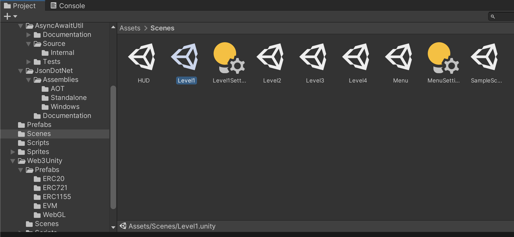

**\[Unity] Transfer721 Example**

* Drag the `Transfer721` prefab under `Assets/Web3Unity/Prefabs/WebGL` dir into the scene.

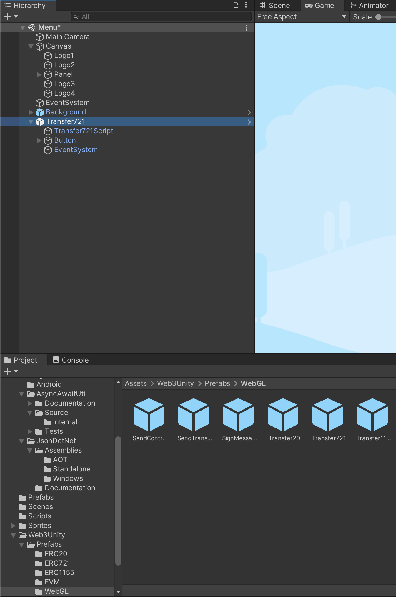

* Update the `Contract` address under `Transfer721Script` object inspector
* Update the `To Account` address to your desired wallet address


***

\* For acquiring the NFT, you can create your own (see [Reference #2](./#2.-smart-contract)), or mint an ERC721 NFT at our [Cronos NFT faucet](https://cronos.org/nft-faucet) (see [Reference #3](./#3.-nft-faucet)).

***

#### Step 4. \[Unity] Build and Run

1. Switch to WebGL platform

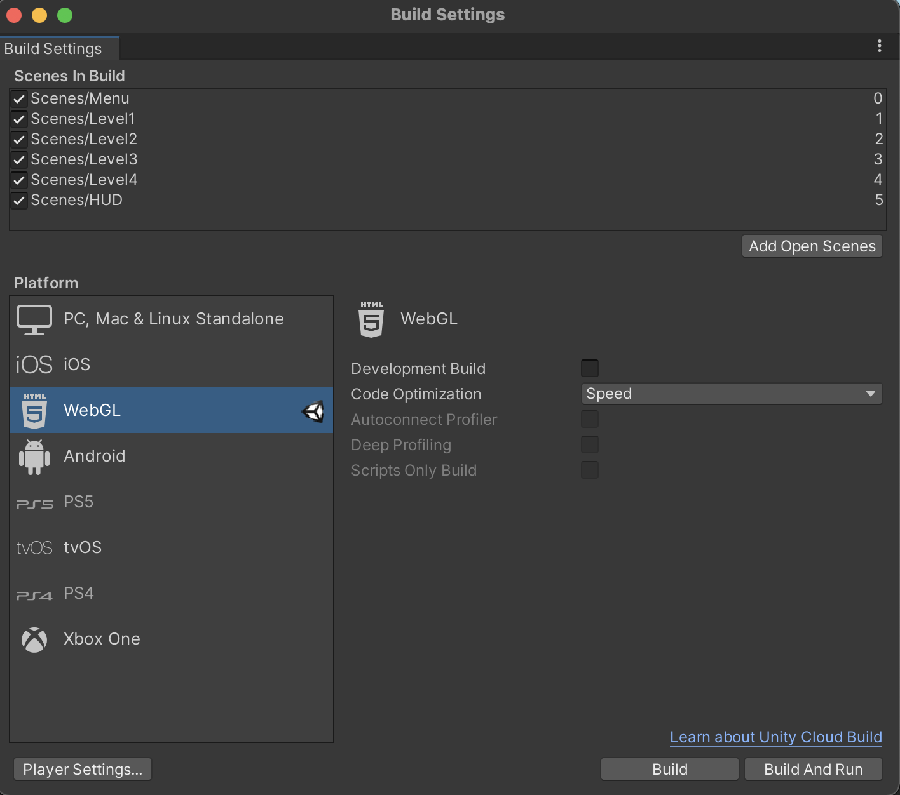

1. Click the `Player Setting` button
2. Select `Web3GL-2020` under `Resolution and Presentation` tab

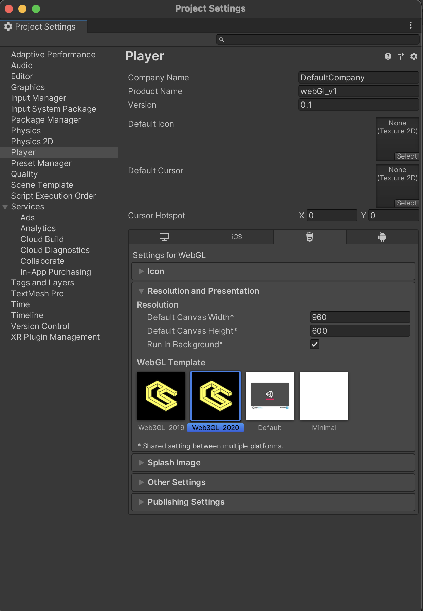

1. Set `Compression Format` to `Disabled` under `Publishing Settings` tab


1. After that, click `Build and Run` button and you are ready to play.

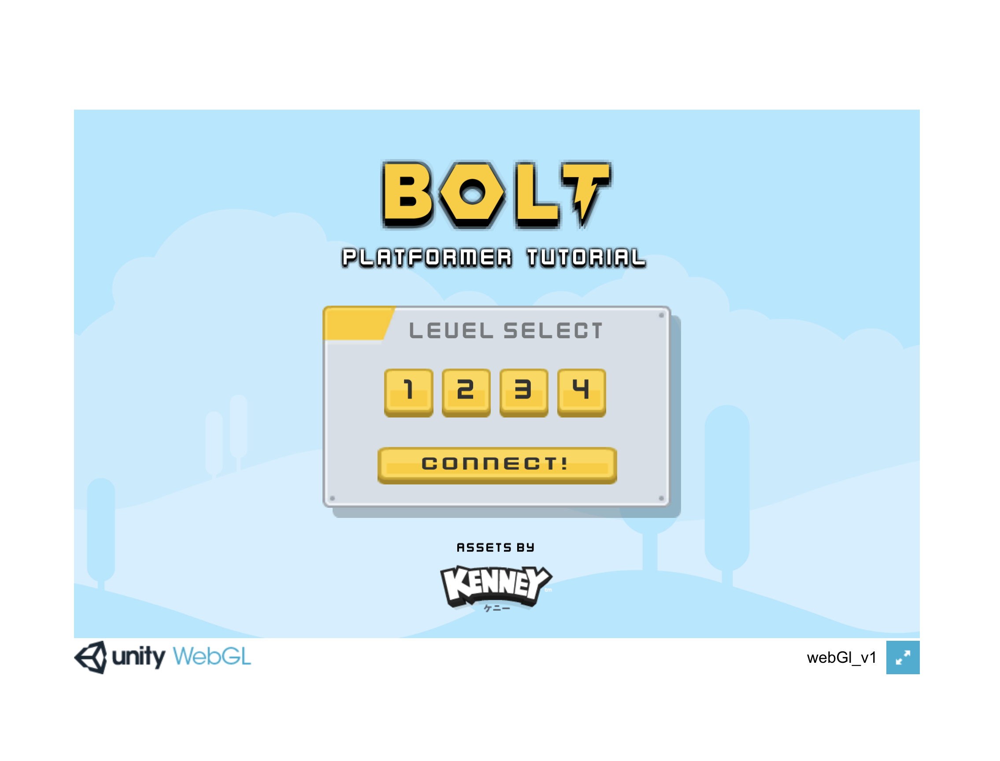

#### What's next

The above guideline documentation only highlights the basic integration between ChainSafe and Cronos chain. You can download the full source code of the above sample game [here](https://github.com/crypto-org-chain/cronos-docs/blob/master/docs/play/assets/cronos-chainsafe-unity-sample.unitypackage.zip). For other ERC protocol methods, please refer to the [ChainSafe Documentation](https://chainsafe.github.io/game-docs/).

### Reference

#### 1. Import Sample package from Unity Asset Store

**Step 1a. \[Unity Asset Store] Click to add the asset and sign in to your Unity account**

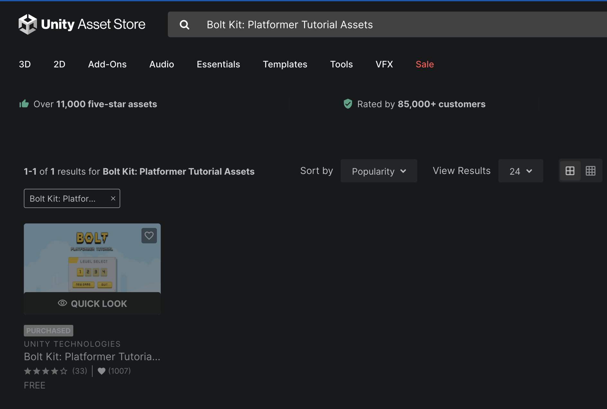

**Step 1b. \[Unity] Create a new project in Unity**


**Step 1c. \[Unity] Open the Package Manager window in Unity and under "My Assets" download the Bolt Kit.**


**Step 1d. \[Unity] Select `Bolt Kit: Platformer Tutorial Assets` and click Import**

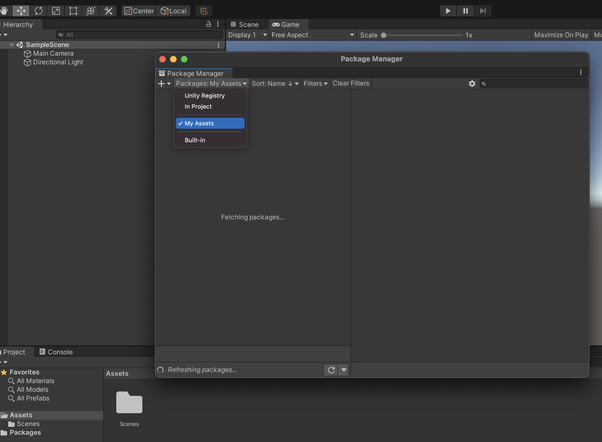

***

#### 2. Smart contract

**2a. Create an ERC standard smart contract**

* ERC20 example

```javascript
// SPDX-License-Identifier: MIT
pragma solidity ^0.8.2;

import "@openzeppelin/contracts@4.4.2/token/ERC20/ERC20.sol";
import "@openzeppelin/contracts@4.4.2/access/Ownable.sol";

contract MyToken is ERC20, Ownable {
    constructor() ERC20("MyToken", "MTK") {
        _mint(msg.sender, 1000 * 10 ** decimals());
    }

    function mint(address to, uint256 amount) public onlyOwner {
        _mint(to, amount);
    }
}
```

* ERC721 example

```javascript
// SPDX-License-Identifier: MIT
pragma solidity ^0.8.2;

import "@openzeppelin/contracts@4.4.2/token/ERC721/ERC721.sol";
import "@openzeppelin/contracts@4.4.2/access/Ownable.sol";
import "@openzeppelin/contracts@4.4.2/utils/Counters.sol";

contract MyNFT is ERC721, Ownable {
    using Counters for Counters.Counter;

    Counters.Counter private _tokenIdCounter;

    constructor() ERC721("MyNFT", "MNFT") {}

    function _baseURI() internal pure override returns (string memory) {
        return "https://opensea-creatures-api.herokuapp.com/api/creature/";
    }

    function safeMint(address to) external onlyOwner {
        uint256 tokenId = _tokenIdCounter.current();
        _tokenIdCounter.increment();
        _safeMint(to, tokenId);
    }
}
```

* ERC1155 example

```javascript
// SPDX-License-Identifier: MIT
pragma solidity ^0.8.2;

import "@openzeppelin/contracts@4.4.2/token/ERC1155/ERC1155.sol";
import "@openzeppelin/contracts@4.4.2/access/Ownable.sol";

contract My1155Token is ERC1155, Ownable {
    constructor()
        ERC1155("https://opensea-creatures-api.herokuapp.com/api/creature/")
    {}

    function setURI(string memory newuri) public onlyOwner {
        _setURI(newuri);
    }

    function mint(address account, uint256 id, uint256 amount, bytes memory data)
        public
        onlyOwner
    {
        _mint(account, id, amount, data);
    }

    function mintBatch(address to, uint256[] memory ids, uint256[] memory amounts, bytes memory data)
        public
        onlyOwner
    {
        _mintBatch(to, ids, amounts, data);
    }
}
```

**2b. Deploy Smart Contract via** [**Remix IDE**](https://remix.ethereum.org/)

```
-  Switch the chain network to Cronos Testnet via Metamask extension or other similar provider
-  Select the `Injected Web3` under ENVIRONMENT tab
```


```
-  Approve the connection
```

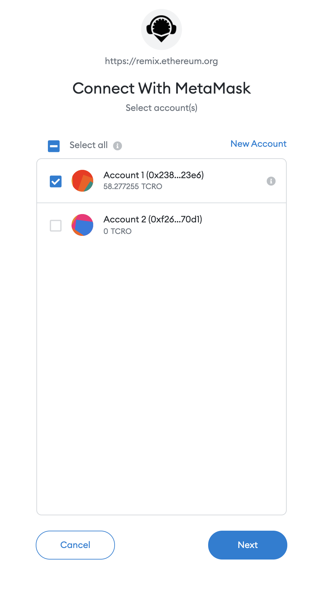

```
-  Select your contract name under CONTRACT tab
```


```
-  Approve the transaction after clicking `Deploy` button
```

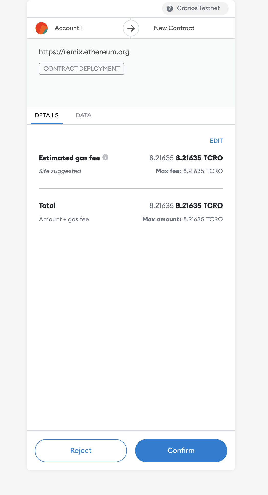

```
-  Copy the contract address
```

***

#### 3. NFT Faucet

* Step 1. Connect your wallet via metamask or walletconnect

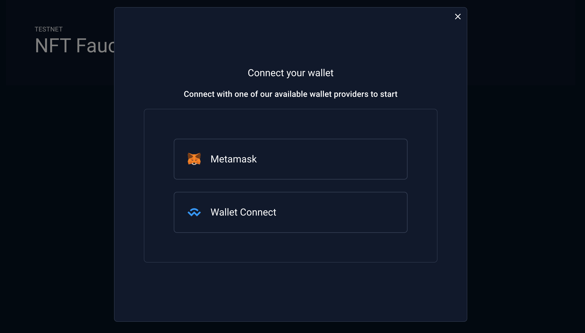

* Step 2. Click `Create NFT` under `YOUR COLLECTION` tab

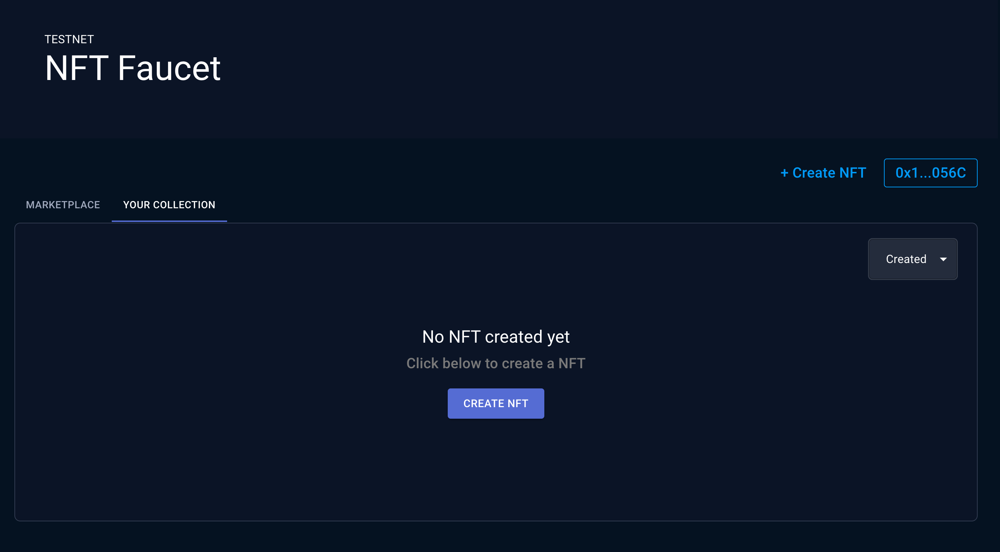

* Step 3. Create and sign the transaction after uploading the image

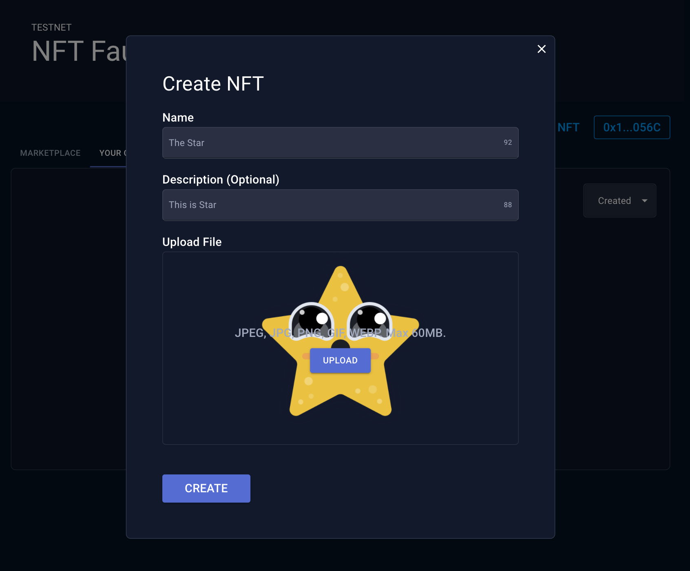

* Step 4. Copy the contract address and image URL from the NFT modal


* Step 5. Paste into the corresponding input box inside Unity inspector

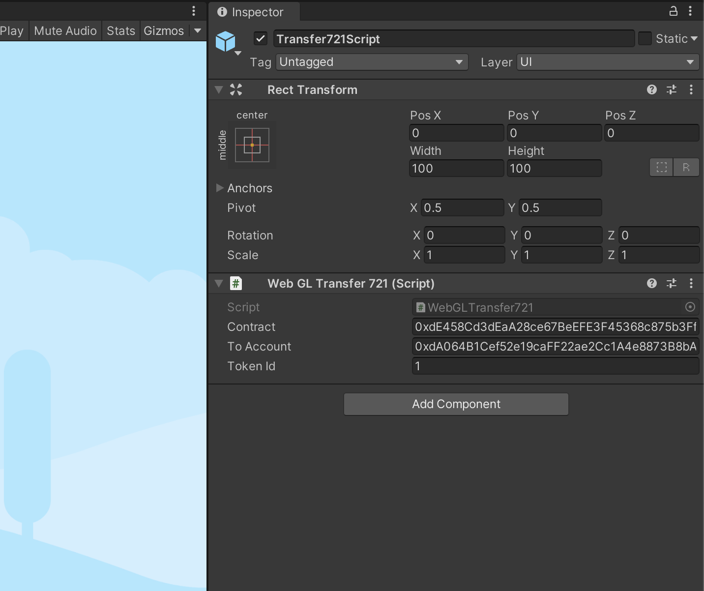

***

#### (Optional) List NFT for sale in marketplace faucet

* Step 1. Fill in the price at list item modal and confirm 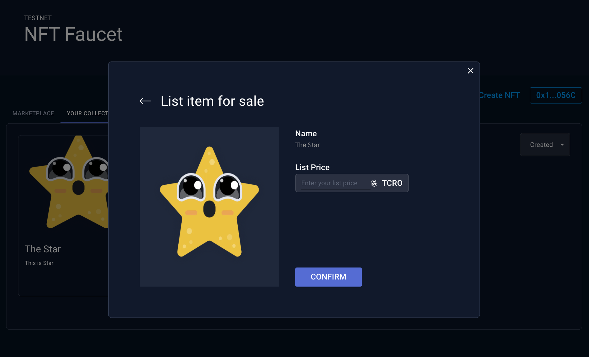
* Step 2. Sign approval and create item transaction 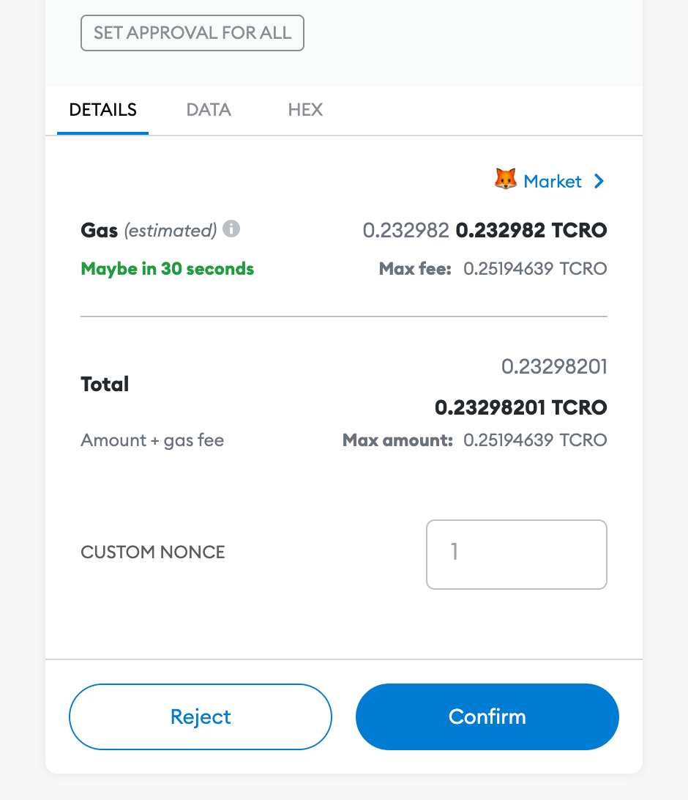 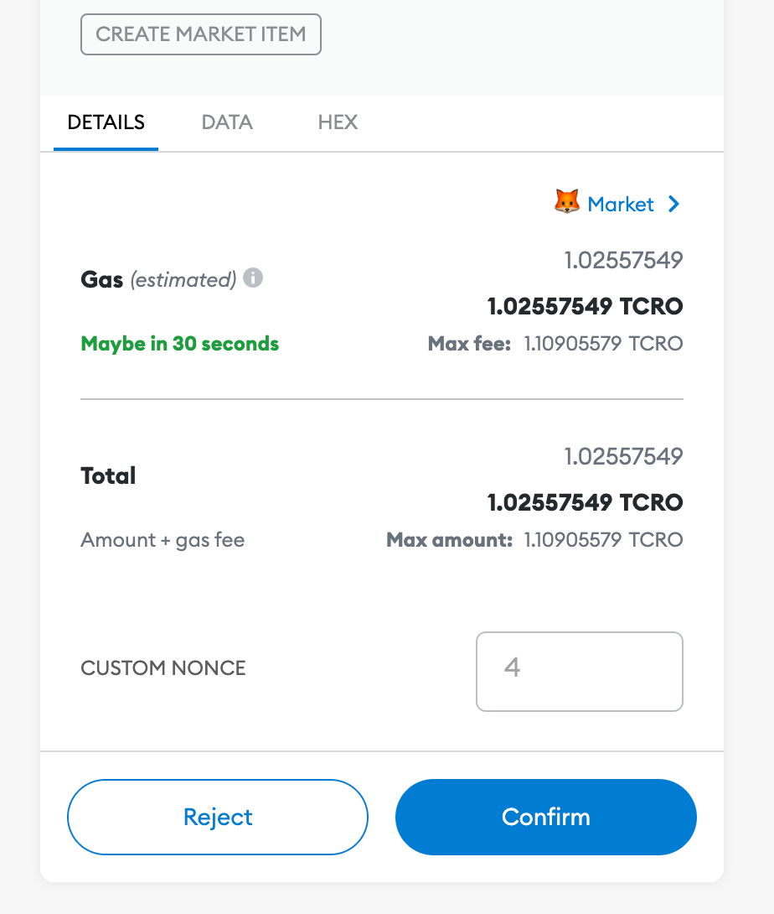
* Step 3. View the listed item in Marketplace tab 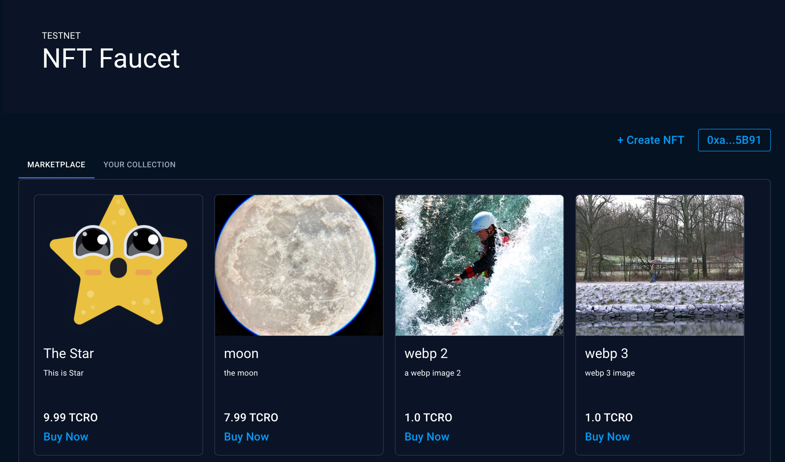
