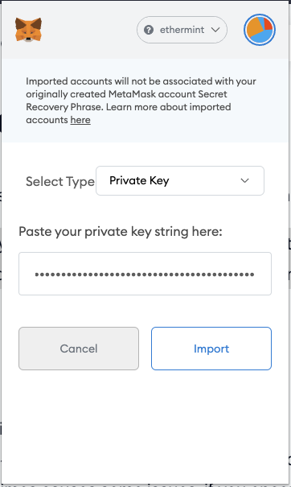
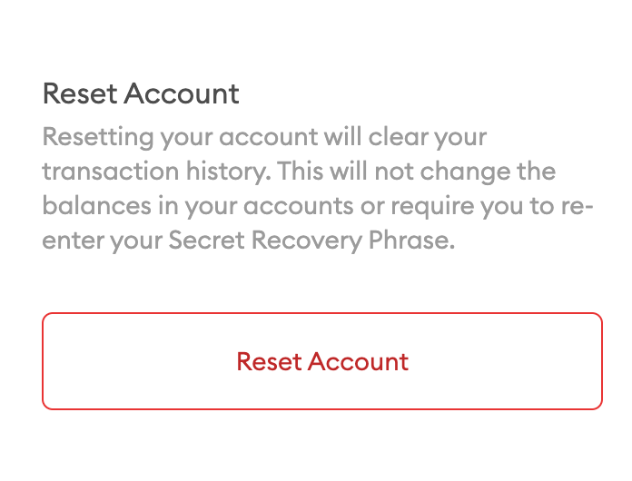

---
meta:
  - name: title
    content: Cronos | Crypto.org EVM Chain | Using MetaMask
  - name: description
    content: >-
      Learn how to use the MetaMask chrome extension to send or receive and
      interact with the Cronos testnet in this technical documentation.
  - name: og:title
    content: Cronos | Crypto.org EVM Chain | Using MetaMask
  - name: og:type
    content: Website
  - name: og:description
    content: >-
      Learn how to use the MetaMask chrome extension to send or receive and
      interact with the Cronos testnet in this technical documentation.
  - name: og:image
    content: https://cronos.org/og-image.png
  - name: twitter:title
    content: Cronos | Crypto.org EVM Chain | Using MetaMask
  - name: twitter:site
    content: '@cryptocom'
  - name: twitter:card
    content: summary_large_image
  - name: twitter:description
    content: >-
      Learn how to use the MetaMask chrome extension to send or receive and
      interact with the Cronos testnet in this technical documentation.
  - name: twitter:image
    content: https://cronos.org/og-image.png
canonicalUrl: https://docs.cronos.org/getting-started/metamask.html
---

# Metamask

In the following step-by-step guide, you will learn how to use the MetaMask chrome extension to send/receive and interact with the Cronos chain.

## Connecting to the Cronos mainnet Beta

First of all we would need to connect the MetaMask with the Cronos chain network:

*   Hit the my account button in the top right corner, under **"Settings"**, select **"Networks"**

    
*   In the **"Networks"** page, click "Add Network":

    



* **Name**: Cronos
* **New RPC URL:**`https://evm.cronos.org`;
* **Chain ID: 25**
* **Symbol:**`CRO`
* **Block explorer URL:**`https://cronoscan.com/`



* **Name:** Cronos testnet
* **New RPC URL:** `https://evm-t3.cronos.org` for
* **Chain ID:**`338`
* **Symbol**:`tCRO`
* **Block explorer URL:** `https://testnet.cronoscan.com/`



* **Name:** Pioneer 11
* **New RPC URL:** `https://evm-p11.cronos.org`
* **Chain ID:**`340`
* **Symbol:**`tCRO`
* **Block explorer URL:**`https://cronos.org/explorer/pioneer11`



* 
* After saving the network config, we should be able to see the token in your address!


## Importing private key to MetaMask

Alternatively, We can export the private key by using the `unsafe-export-eth-key` command with `cronosd`, for example:

```bash
cronosd keys unsafe-export-eth-key mykey --keyring-backend test
```

It will show your private, we can copy it for the next step.

Then hit my account button in the top right corner again, select "Import Account" under "My account" on your MetaMask:


Paste the private from the former step here and click "Import".



Once it has been connect, you should see the balance and may start performing transactions via MetaMask!

## Address conventions

Note that the address format in Cronos is in there form of bech32 `crc...` , we can use `cronosd debug addr` to convert an address between hex and bech32, for example:

```bash
$ cronosd keys list --keyring-backend test
  - name: mykey
    type: local
    address: crc19a6r74dvfxjyvjzf3pg9y3y5rhk6rds2c9265n
    pubkey: '{"@type":"/ethermint.crypto.v1alpha1.ethsecp256k1.PubKey","key":"Azy1tg0wZKRdQ7sd9mICzteCstGThiodZtQqlVT9Amlc"}'
    mnemonic: ""

$ cronosd debug addr crc19a6r74dvfxjyvjzf3pg9y3y5rhk6rds2c9265n
    Address: [47 116 63 85 172 73 164 70 72 73 136 80 82 68 148 29 237 161 182 10]
    Address (hex): 2F743F55AC49A446484988505244941DEDA1B60A
    Bech32 Acc: crc19a6r74dvfxjyvjzf3pg9y3y5rhk6rds2c9265n
    Bech32 Val: crcvaloper19a6r74dvfxjyvjzf3pg9y3y5rhk6rds2ph398y

$ cronosd debug addr 2F743F55AC49A446484988505244941DEDA1B60A
  Address: [47 116 63 85 172 73 164 70 72 73 136 80 82 68 148 29 237 161 182 10]
  Address (hex): 2F743F55AC49A446484988505244941DEDA1B60A
  Bech32 Acc: crc19a6r74dvfxjyvjzf3pg9y3y5rhk6rds2c9265n
  Bech32 Val: crcvaloper19a6r74dvfxjyvjzf3pg9y3y5rhk6rds2ph398y
```


Remarks: One would have to add the `0x` at the beginning when using the Ethereum HEX address shown as above: for example: `Address (hex): 2F743F55AC49A446484988505244941DEDA1B60A` implies that `0x2F743F55AC49A446484988505244941DEDA1B60A` will be the address in the Ethereum manner.


## Resetting your account on Metamask

If you come across any issue with your account or you have used the imported account to perform transactions in the legacy testnet, you can reset it by using the `Reset Account` function on the MetaMask.

Simply go to `Setting/Advance` and click `Reset Account` as shown below:



## FAQs for ERC20-only transaction Support

### Q1: I transferred CRO from the other centralized exchanges (CEXs) to the Crypto.org Desktop wallet, but why it is not showing up in my Crypto.com DeFi Desktop Wallet?

**A** : Some centralized exchanges currently only support Ethereum mainnet ERC20-CRO withdrawal, while the Crypto.com DeFi Desktop Wallet only supports Crypto.org Chain & Cronos Beta Chain for the moment, thus you're not able to view any ERC20 assets or balances of Ethereum Chain on the Desktop Wallet. It is highly recommended that all users check the networks before making the withdrawal and always begin with a small amount to make sure the transfer actually works.

### Q2: I’ve already made the transfer from the centralized exchange that does not support Cronos Beta Chain to my Crypto.com DeFi Desktop Wallet. What should I do to retrieve my funds?

**A** : Here's what you could do:

1. Send some ETH (around 0.03 ETH) to your `0x..` address for paying the transaction gas fee on Ethereum
2. Download our Crypto.com App, and register an account (skip this if you're already a user)
3. Send your ERC20-CRO to the Crypto.com App ERC20-CRO deposit address\*
4. When you get your CRO, withdraw your CRO to your ledger address (MAKE SURE YOU SELECT Cronos Beta Chain) `0x..` address
5. You would be able to see your funds on Crypto.com DeFi Desktop Wallet afterwards

Other than this, it is also possible that there is no Ethereum in your wallet, which could result in your funds getting stuck as you aren't able to pay for the Ethereum gas fee. Please ensure you have enough ETH for the transaction.

_For step 3 of transferring your ERC20-CRO, you could either use Metamask or Ledger Live (for ledger user) to send ERC20-CRO from your Ledger to Crypto.com App. Take the wallet on Metamask as an example, if you log into the same wallet on Metamask and switch the network to the ethereum mainnet on Metamask, you would be able to access those ERC20 tokens in this wallet on Metamask. After that, you would be free to transfer the funds to the Crypto.com app then withdraw them to the Cronos Beta network._

### Q3: I would like to send ERC20-CRO from Crypto.com App or Defi Wallet to the other CEXs directly. Is it possible?

**A** : Please make sure both sender and receiver accounts support ERC20 format. Only if the other CEXs support ERC20-CRO can you send it. Users may refer to this guide for more details:

* https://help.crypto.com/en/articles/5019195-send-and-receive-cro-the-difference-between-native-cro-and-erc20-cro
* https://help.crypto.com/en/articles/4970776-cro-deposit-withdrawal-information-in-crypto-com-app

### Q4: I made a transaction on MetaMask (through Cronos Beta network) to the other CEXs that do NOT support Cronos. How should I retrieve it back?

**A** : In this case, only the owner of the receiving account has access to that funds. You could also check if your transaction is successful/confirmed on [Cronoscan](https://cronoscan.com/). Given the receiving account is from other CEXs, you may contact the receiving party and find out if it is possible for them to do a manual refund for your transaction. They may or may not do it depending on their own policies. Otherwise, you will most likely not be able to access the funds until that CEX starts to support Cronos.
